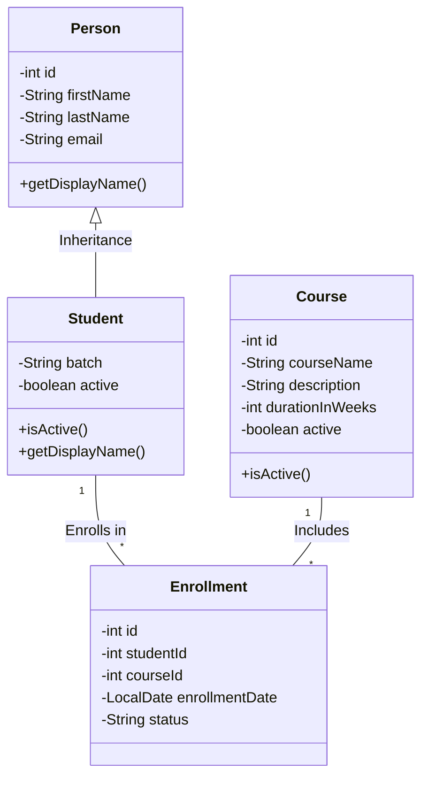

# LearnTrack

LearnTrack is a console-based Student & Course Management System built with Core Java. This application demonstrates foundational object-oriented programming (OOP) principles, clean code practices, basic collections handling via `ArrayList`, and standard exception management.

## Features
- **Student Management:** Add, view, search, and deactivate students.
- **Course Management:** Add, view, and toggle active status for courses.
- **Enrollment Management:** Enroll students in courses, view active enrollments, and update statuses.

## Getting Started

### Prerequisites
- JDK 11 or higher installed on your system.

### Compilation
Navigate to the root directory `learntrack/`:
```bash
javac -d out $(find src -name "*.java")
```

### Running the Application
Run the `Main` class from the `out/` directory:
```bash
java -cp out com.airtribe.learntrack.ui.Main
```

## Class Architecture Diagram


