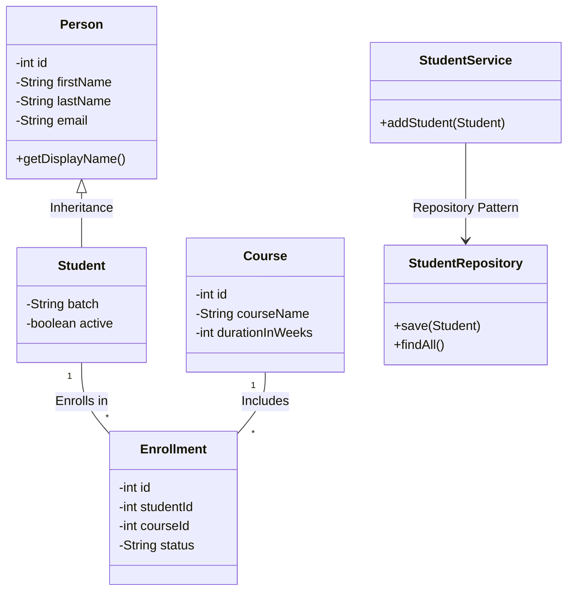

<div align="center">
  # LearnTrack 📚
  <p><i>A console-based Student & Course Management System built entirely with Core Java.</i></p>
  
  
  
</div>

## 📖 Overview
LearnTrack is a foundational OOP-driven project designed to track students, courses, and active enrollments using in-memory `ArrayList` data structures without relying on heavy frameworks. 

Recently refactored to implement the **Repository Design Pattern** separating raw data logic from the operational `Services` layer!

## ✨ Key Features
- **Student Data Management:** Add, search, and securely deactivate institute students.
- **Course Catalog Management:** Add, view, and toggle visibility parameters for available courses.
- **Dynamic Enrollments:** Map students directly to available courses enforcing state validation workflows safely.

## 🚀 Getting Started

### Prerequisites
- JDK 11 or higher installed.

### Build Instructions
Clone the repository and compile the native files via:
```bash
javac -d out $(find src -name "*.java")
```

### Run Instructions
Start the interactive application from the `out` distribution directory:
```bash
java -cp out com.airtribe.learntrack.ui.Main
```

## 🏗️ Architecture Design (UML)


